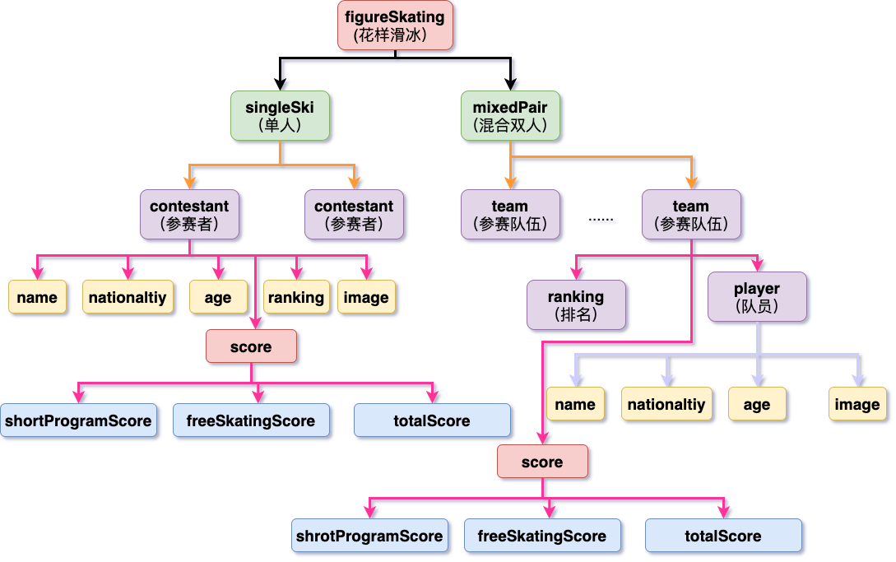

# XML课程作业
> 组名：Dracula
## 第一周作业
* [x] 模型建立
    
* [x] 第一周xml文件
    * [Dracula1_1.xml](./week1/Dracula1_1.xml)

## 第二周作业
* [x] xml文件
    * [Dracula2_1.xml](./week2/Dracula2_1.xml)
* [x] dtd文件
    * [figureSkating.dtd](./week2/figureSkating.dtd)
